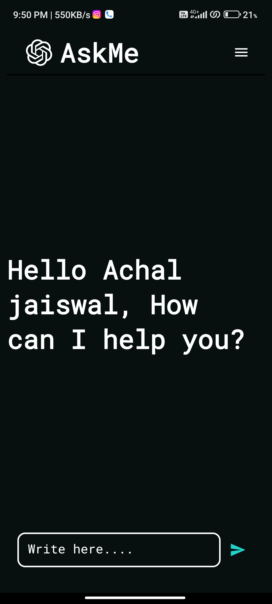
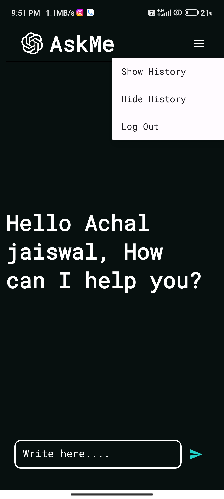
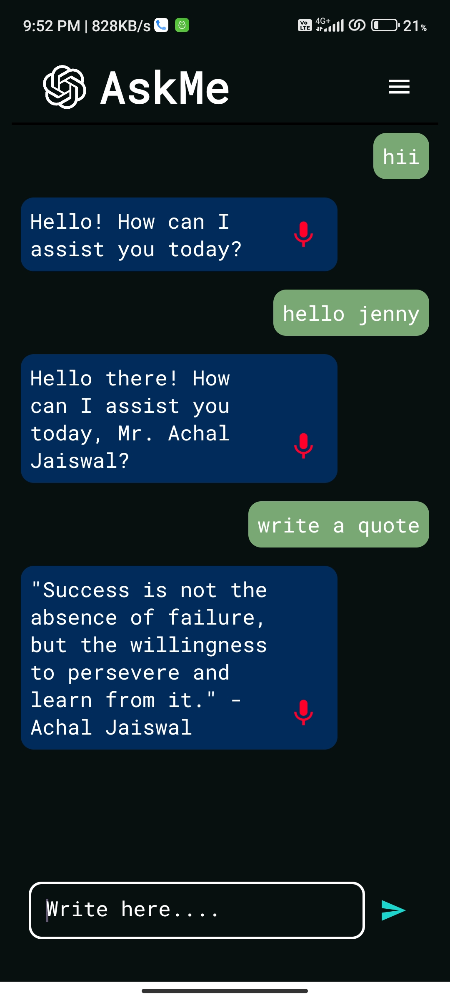

# AskMe - Your Personal Assistant Chat Android Application 💬🔒🔊

Welcome to AskMe, your AI-powered personal assistant! The AskMe Android Application provides you with an intuitive platform to interact with Jenny, your virtual assistant. Experience the synergy of user authentication, natural language processing, text-to-speech, and personalized conversations all in one app.

## Screen Shots

<p align="center">
  
  
    
</p>

<p align="center">
  
  
    
</p>

## Features

- **Real-time Chatting**: Engage in seamless, real-time conversations with Jenny, your personal assistant, directly within the AskMe app.

- **Natural Language Processing**: AskMe leverages the power of the OpenAI API to process your input and craft contextually relevant and human-like responses.

- **Personalization**: Tailor Jenny's responses to match your unique preferences and commands, making your interactions with AskMe truly personal.

- **Conversation History**: Easily revisit past conversations to access important information and maintain a coherent history.

- **User Authentication**: Safeguard your privacy with Firebase Authentication, allowing you to securely register and log in.

- **Text-to-Speech**: Enjoy the convenience of having Jenny's responses converted to audible speech using text-to-speech technology.

- **User-friendly Interface**: Navigate through AskMe's intuitive and user-friendly interface for effortless interactions.

## Prerequisites

Before you start, make sure you have the following:

- Android Studio: The official IDE for Android application development.

- OpenAI API Key: Obtain an API key from OpenAI to unlock advanced language processing capabilities.

- Firebase Project: Create a project on Firebase and set up Firebase Authentication.

## Installation

1. Clone this repository to your local machine:

    ```bash
    git clone https://github.com/Achaljs/AskIt.git
    ```

2. Open the project in Android Studio.

3. Replace `your_API_Key` in the code with your actual OpenAI API key.

4. Configure Firebase in your Android project based on the Firebase documentation.

5. Build and run the application on an Android emulator or a physical device.

## Usage

1. Launch the AskMe app on your Android device.

2. If you're new, create an account using your email and password. If you're returning, log in with your credentials.

3. Start a conversation by typing your message in the text input area.

4. Tap the send button to transmit your message to Jenny.

5. View Jenny's response in the chat area and listen to it as spoken words using the text-to-speech feature by tapping the Mic button.

6. Continue the conversation by sending additional messages.

## Limitations of ChatGPT API

 It's important to note that while ChatGPT, powered by OpenAI, is incredibly powerful, it does have certain limitations:

1. Lack of Context: ChatGPT doesn't have inherent memory of past requests, meaning you might need to provide more context within the conversation.

2. Generating Plausible-sounding but Incorrect Answers: The model might generate responses that sound plausible but are factually incorrect or nonsensical.

3. Sensitive Content: The model might sometimes produce inappropriate or offensive content. The app should have mechanisms to filter and prevent such outputs.

## Configuration

Customize the app to your liking:

- **API Key**: Replace `YOUR_OPENAI_API_KEY` with your actual OpenAI API key.

- **Firebase Configuration**: Set up Firebase services as directed in the Firebase documentation.

## Contributing

Contributions are welcome! Report bugs or suggest improvements through pull requests or issues.

## License

This project is licensed under the MIT License - see the [LICENSE](LICENSE) file for details.

---

If you have questions or feedback, feel free to reach out. Embrace the power of AskMe, your AI personal assistant, now encompassing enhanced features for your convenience! 🤖💬🔒🔊
